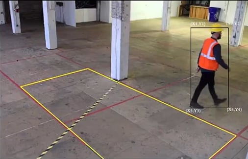
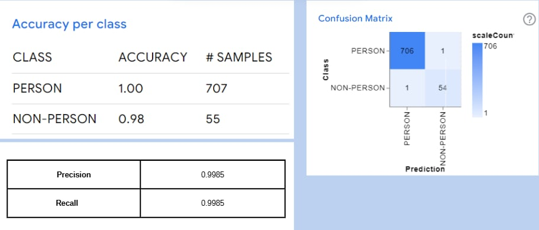
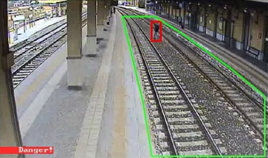

# Real-Time Object Detection Warning System  
> Project conducted: May 2024 (was not uploaded at the time)

A real-time computer vision system using YOLO for object detection with danger zone alerts, sound notifications, and automated Telegram & Email warnings.

Video demo: https://www.youtube.com/watch?v=orFa52maBXw&t=2s
---

## Introduction



This project aims to build an automated **safety warning system** that uses computer vision and object detection to identify intruding objects within a predefined danger zone. When a detected object enters the danger area, the system will:

- Play an alarm sound locally  
- Send a warning message with image evidence via **Telegram** and **Email**

**Key Applications:**
- Intruder detection for security systems  
- Safety monitoring in industrial zones  
- Automated alerts in self-driving car assistance systems

---

## Dataset

### Source
- **Images:** 5,074 annotated images (4712 person, 362 non-person)
- **Model:** Pre-trained YOLOv4 model used for object detection

### Performance
- **Precision:** 0.9985  
- **Recall:** 0.9985


---

## Tools & Technologies

- **Languages:** Python  
- **Libraries:** OpenCV, YOLOv4, Shapely, smtplib, telegram API  
- **Hardware:** Requires GPU for optimal real-time performance

---

## Project Workflow

### 1. Setup & Running the System

- Run `code/main.py`  
- The script will:
  - Open webcam feed  
  - Allow the user to define a danger zone by clicking 4 points using the mouse (`D` key to finalize)  
  - Start real-time object detection using YOLOv4
  - Continuously check if any detected object’s coordinates fall inside the defined danger zone

### 2. Object Detection

- Utilizes **YOLOv4** to detect objects within the camera feed in real-time.
- Bounding boxes are drawn around detected objects with labels and confidence scores.


### 3. Danger Zone Checking

- Uses **Shapely** library to:
  - Define and process the user-drawn polygon as the danger zone
  - Check if object centroids fall within this zone



### 4. Warning & Notification

- If an object enters the danger zone:
  - **Sound alarm:** plays a local audio file as an immediate alert  
  - **Telegram alert:** sends a photo with a warning message to a pre-configured chat  
  - **Email notification:** sends an email with the captured frame and warning details

---

## Result

Running the system displays:

- Real-time webcam window with bounding boxes and danger zone overlay  
- Console log of detection events and notification status  
- Sends alerts to configured Telegram chat and Email address when an intrusion is detected

---

## How to Use

1. Clone the repository and install required libraries (`code/setup.txt`).  
2. Configure your Telegram bot token, chat ID, and email SMTP settings in ``code/main.py``.  
3. Run:
   ```bash
   python main.py

## Project Resources
To understand this project in detail:
- Presentation: Read the project presentation slides in `slide_presentation.pdf`
- Demo Video: Watch the [demo video](https://www.youtube.com/watch?v=orFa52maBXw) to see the system in action

**Both files are included in this repository for better understanding of the workflow, functionality, and real-world application of the system.**

## Learning Outcomes

- Built a functional real-time object detection system with YOLOv4.
- Integrated computer vision with notification APIs for automated alerts.
- Applied spatial geometry checking (Shapely) for zone-based detection.
- Strengthened skills in Python, OpenCV, and deployment of AI-powered safety solutions.

## Requirements
- opencv-python
- numpy
- imutils
- python-telegram-bot

**Please install using pip and ensure compatible versions based on your Python environment.**
